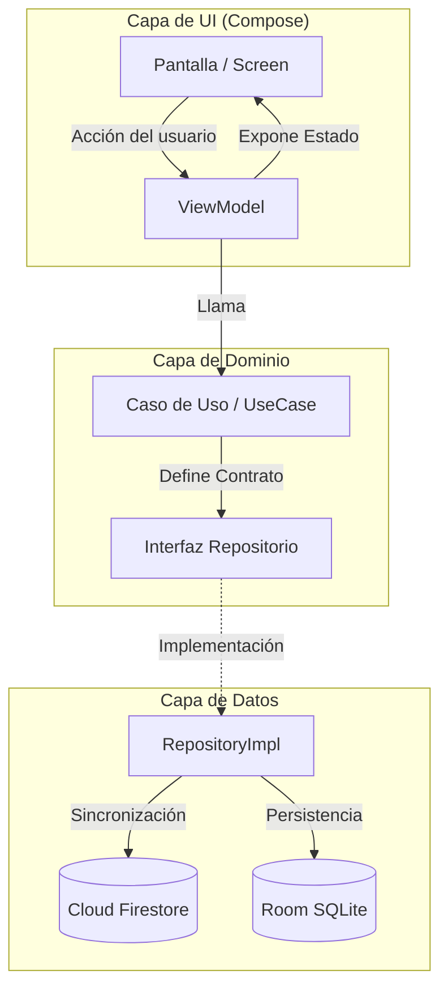
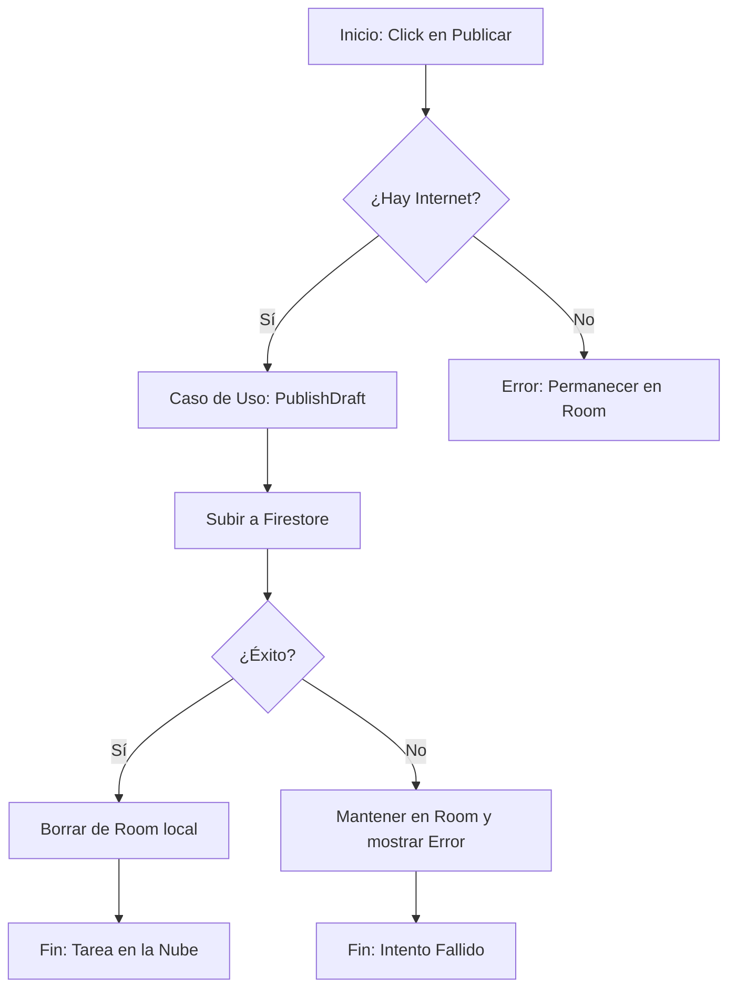
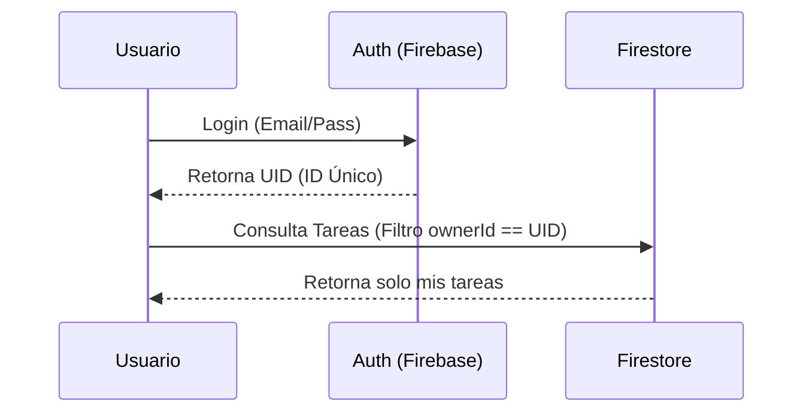

# Diagramas de Flujo del Proyecto

Estos diagramas representan la lógica técnica de la aplicación "Gestor Personal de Tareas".

## 1. Arquitectura General y Flujo de Datos
Este diagrama muestra cómo se comunican las capas desde que el usuario pulsa un botón hasta que el dato llega a la nube o al disco.

---

## 2. Flujo Crítico: Publicación de Borradores
Este diagrama detalla la lógica de "Seguridad de Datos" que implementamos para mover un borrador local a la nube.

---

## 3. Flujo de Autenticación y Seguridad
Muestra cómo el `ownerId` protege la información.

